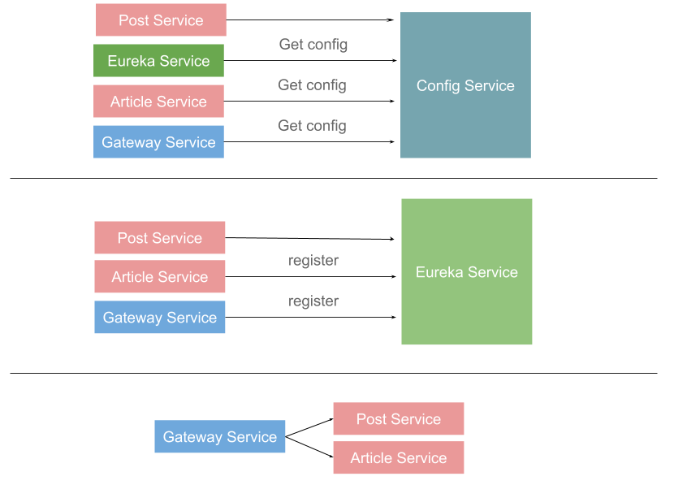
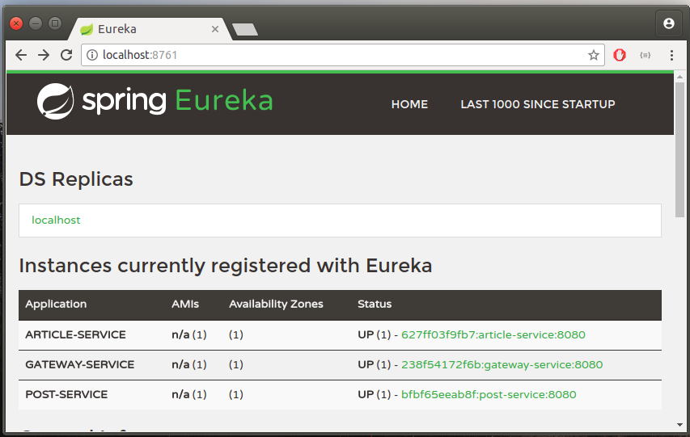
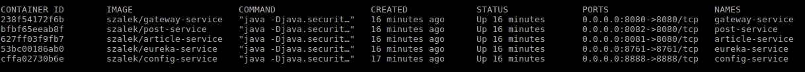

# Base on
- https://www.youtube.com/watch?v=ZyK5QrKCbwM

# Build project
- _docker/build.sh

# Run
- _docker/up.sh

# Kill
- _docker/down.sh

# Gateway
- http://localhost:8080/post-service
- http://localhost:8080/article-service

# Post Service
- http://localhost:8081/

# Article Service
- http://localhost:8082/

# Configuration
- https://github.com/szalek/SpringMicroservicesConfig

# Configuration API
- http://localhost:8888/eureka-service/master
- http://localhost:8888/article-service/master
- http://localhost:8888/post-service/master

# Eureka
- http://localhost:8761/

# Diagrams

# Eureka

# Console
